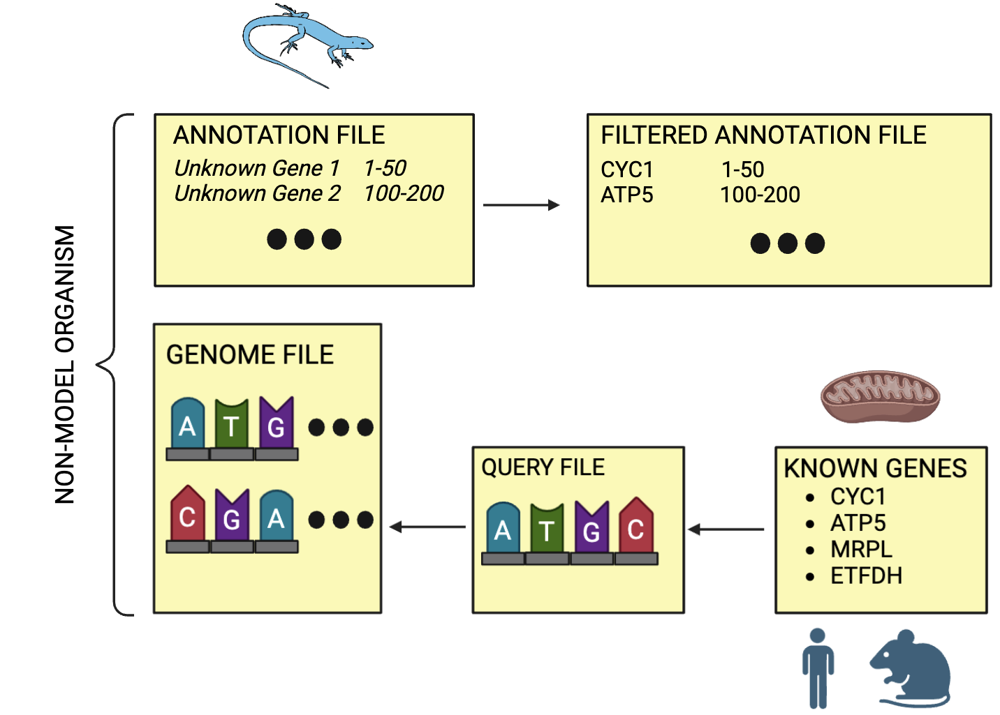

# MiCFiG

MiCFiG (MitoCarta Filter GFF) is a bioinformatics tool that uses the MitoCarta genomic database to to filter GFF files of nonmodel organisms.

# Contents

- [Context](#context)
- [Methods](#methods)
  - [Scripts](#scirpts)
  - [Pipeline](#pipeline)
- [Walkthrough](#walkthrough)
  - [Installation](#installation)
  - [Requirements](#requirements)
  - [Steps](#steps)
  - [Final Products](#final-products)

## Context

A common practice in bioinformatics is to annotate genomic files. Annotation files (e.g. BED & GFF) contain the locations of known genes in genomic files, acting as a road map for genes of interest. By their definiton, the genomes model organisms are incredibly well-annotated - lots of people have taken to the call and had their work double- & triple-checked. However, the pool of non-model organisms without fully annotated genomes is vast. 

MiCFiG aims to make annotation of species with incomprehensive genetic labeling a much easier process. It does so by using BLAST to identify & filter genetic features in non-model organisms based on homologies with model species. The MitoCarta database, a catalog of mitochondrial & nuclear protein-encoding genes in *Homo sapiens* & *Mus musculus*, provides a diving board for such comparisons.

## Methods

The MiCFiG pipeline is intended for non-model organisms with genomes that are not thoroughly annotated with informative gene names. By using the MitoCarta database, the seqeunces of known human genes are used as queries for non-model organisms to identify mitochondrial-targeting genes. These are then extracted in a filtered annotation file & named, providing annotated genes for downstream analysis.

### Scripts

* split_fasta.py
  * Takes a comprehensive FASTA file (in this case, taken from the MitoCarta database) and splits it into individual FASTA files - one for each sequence

* blast_script.sh
  * Loops through FASTA files and performs a BLAST search

* process_blast_results.sh
  * For each BLAST hit, grabs the minimum subject start and maximum subject end from the top rated HSP score
  * process_blast.py
    * Processes BLAST results and makes a BED file for the top hits based on HSP score

* filter_gff.py
  * Identifies overlaps between BED & GFF files
  * Determines which gene from model organism belongs with the genes in non-model organism

* add_gene_name.sh ( I think this goes here in the pipeline )
  * Adds MitoCarta gene name to GFF file
    * Accounts for potential differences in genetic nomenclature between species
  * extract_gene_name.py
    * Extracts gene name & sequence ID from MitoCarta-produced FASTA file & puts it in a lovely text file

* process_gff.py
  * Creates complete & annotated GFF file for non-model organism
  * Keeps track of genes not found to have a sister homology

### Pipeline

## Walkthrough

### Installation

To clone this repository using HTTPS, enter the following into the command line:

	git clone https://github.com/KLab-UT/MiCFiG.git

To clone this repository using SSH, enter the following into the command line:

	git clone git@github.com:KLab-UT/MiCFiG.git

### Requirements

MiCFiG as it stands is computationally and time intensive. Using the scripts will require a high performance computer in order to function in a timely manner and without frying your machine.

MiCFiG will require a starting annotated genome as a GFF file, as well as a FASTA file containing the sequences of the genome. Everything else is provided by the repository.

WARNING: The scripts meant to run MiCFiG are currently specified for the test organism, *Aspidoscelis marmoratus*. We are still working on making the scripts generalized to run for any non-model organism.

### Steps

Before running main.sh, you need to take the target organism's genomic sequences in FASTA format and turn them into a BLAST database. This needs BLAST installed on your device, which can be accomplished by running the following code:

	makeblastdb -in your_sequences.fasta -dbtype nucl -out your_database_name

With your BLAST database, you can now run main.sh:

	bash main.sh

### Final Products

Running MiCFiG will create a working directory and the following:

* fastas/proteins
  * Found in working directory
  * Directory
  * Contains the sequences for each protein from MitoCarta in individual files

* blast_results/tblastn_output
  * Found in working directory
  * Directory
  * Results from tblastn

* tblastn_bed_files
  * Found in working directory
  * Directory
  * BED files generated for each BLAST result

* gene_ids.csv
  * Found in repository
  * File
  * Contains genes and their associated IDs

* tblastn_gff_filtered
  * Found in working directory
  * Directory
  * Contains the filtered GFFs of each gene

* tblastn_gff_filtered/not_found.txt
  * Found in working directory
  * File
  * Keeps track of genes not found when creating final processed GFF file

* tblastn_log.csv
  * Found in repository
  * File
  * Logs ID, gene, and annotation

* tblastn_merged.gff
  * Found in repository
  * File
  * Final annotated genome for non-model organism
