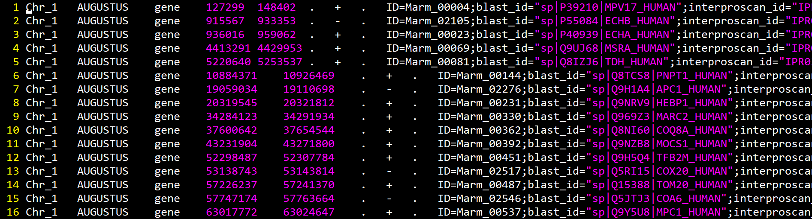
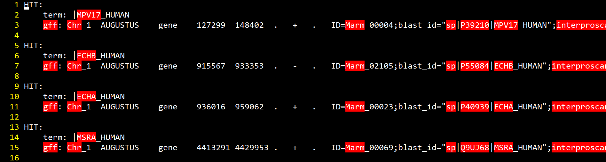
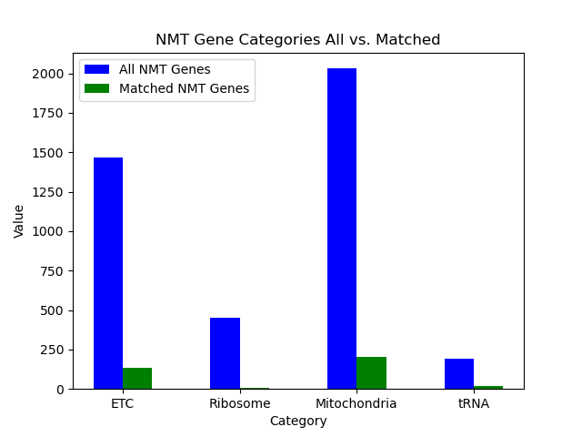
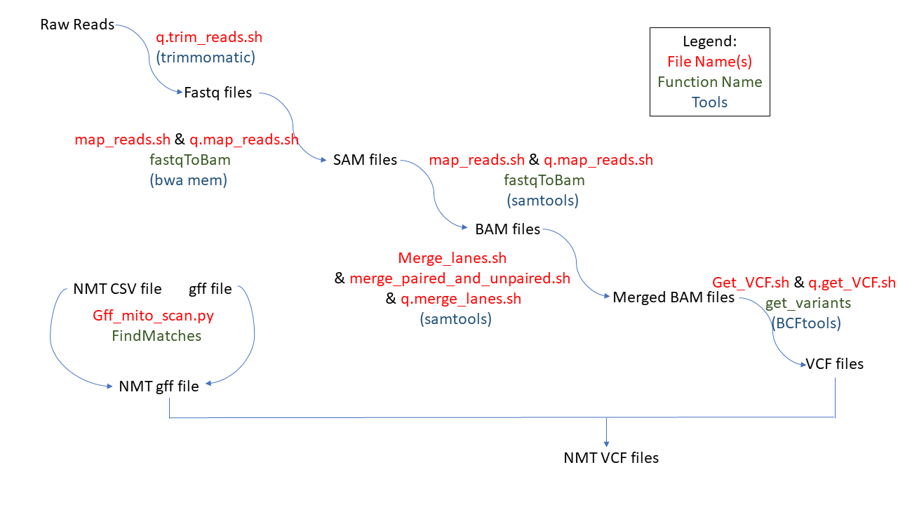

# MiCFiG
MiCFiG is a bioinformatics tool for using the **Mi**to**C**arta database to **Fi**lter a **G**FF file.

Testing: A total of 12 files were used where two were Python and ten were bash scripts to examine the amount of genetic variation in nuclear-encoded mitochondrial-targetting (NMT) genes between sexual species of whiptail lizards (genus Aspidoscelis) using whole-genome sequencing data.

# Contents

- [Abstract](#abstract)
- [Hypothesis](#hypothesis)
- [Methods](#methods)
  - [Gff_Mito_Scan](#walkthrough-Gff_Mito_Scan)
  - [Match_Data](#walkthrough-Match_Data)
  - [Pipeline](#pipeline)
- [Next Steps](#nextsteps)

# Introduction (Project Impetus)

 Hybrid parthenogenic whiptail species have lower endurance capacity and mitochondrial respiration than their sexual parental species. These differences in aerobic performance may be due to reduced compatibility of variable gene products between the divergent parental genomes that are present in the hybrids. If this is the case, we expect to see genetic variation in nuclear-encoded, mitochondrial-targetting genes (Nmt genes). We performed whole-genome sequencing for four sexual whiptail species that are parental species to hybrid parthenogenetic species, and we mapped those samples to an annotated whiptail genome. We will call gene variants and filter out the variants in Nmt genes using a GFF provided by MiCFiG.

# Hypothesis
We hypothesize that lower endurance and mitochondrial respiration in these lizards is a result of reduced genetic compatibility in NMT genes due to either 
(A) inter-genomic interactions or (B) intra-genomic interactions. 
- Inter- and intra- prefixes are in reference to the parental genomes of the parthenogenetic whiptails, which are of hybrid origin (i.e., the crossing of two divergent species resulted in the new evolutionary lineage of the parthenogenetic species).
  - Inter-genomic refers to interactions between parental genomes (between gene products of maternal ancestry and gene products of paternal ancestry).
  - Intra-genomic refers to interactions within a parental genome (e.g., between nuclear gene products of maternal ancestry and mitochondrial gene products of maternal ancestry). 

Examining the NMT genetic variability between the sexual parental species provides a base for testing the inter-genomic hypothesis: If we find variation in NMT genes between hybridizing species, this variation is likely present in the genomes of the parthenogenetic species. If no variation is present in NMT genes between hybridizing species, then a source other than reduced compatibility between the divergent genomes is responsible for the reduced performance in parthenogens (e.g., intra-genomic interactions). 

# Methods
As a first step in this project, we will be determining whether the parental species have differences in their NMT genes, to determine if there are inter-genomic interactions. To do this we first need to determine which genes are NMT genes. 

Clone the repository by navigating to the top of this page and clicking code and then copying either the https or SSH keys version. Enter the following code in the command line in the command line in the directory you want to clone it in:

  ```
    git clone "link you copied"
  ```

Once you have cloned the repository 'cd' into it and we can get started. 

## Walkthrough-Gff_Mito_Scan

Starting with the best annotated genome, `a_marmoratus_AspMarm2.0_v1.gff`, we will sort out all of the NMT genes using the file, `Human.MitoCarta3.0.csv`. This file contains all of the human NMT genes with all of their symbol names. These names will be used to sort through the gff file and pull out any of the *Amlops marmoratus* genes which have the same symbol name. 

To do this we will use the python filie `gff_mito_scan.py`. Copy the following and paste it into the command line so we can understand the file and what is required. 

  ```
    vim gff_mito_scan.py
  ```

Now that we understand what we will need to run the file, lets copy the following code and paste it into the command line to sort through the gff file and produce our log file. 

  ```
    python gff_mito_scan.py -m Human.MitoCarta3.0.csv -g a_marmoratus_AspMarm2.0_v1.gff
  ```

Or if you would like to give another name to your output files copy the following and enter your desired file names. 

  ```
    python gff_mito_scan.py -m Human.MitoCarta3.0.csv -g a_marmoratus_AspMarm2.0_v1.gff -o 'name of output file'.gff -l 'name of log file'.txt
  ```

The desired output should resemble the following.

The sorted NMT genes in a gff file:



The log file showing which terms hit which gene:



Once the desired output is obtained we can move on to the next script to obtain some data about the sorted genes. 

## Walkthrough-Match_Data

Starting with the `Human.MitoCarta3.0.csv` file again and the `log_file.txt` (or whatever you named your log file) we will create a bar plot to represent how many hits we got in each category of gene. All of the genes in the `Human.MitoCarta3.0.csv` file were sorted into each of the four categories: 'ETC', 'Ribosomal', 'Mitochondria', and 'tRNA'. 

In the python file `match_data.py` we will sort the matched genes and plot them on a bar graph. Copy the following and paste it into the command line so we can understand the file and what is required. 

  ```
    vim match_data.py
  ```

Now that we understand what we will need to run the file, lets copy the following code and paste it into the command line to sort through the gff file and produce our log file. 

  ```
    python match_data.py Human.MitoCarta3.0.csv log_file.txt
  ```

The desired output should resemble the following.

The bar plot:



Once we have the desired output we can move on to big picture tying in the rest of the code.


## Pipeline

The bash files that are in the repository go through mapping the other genomes of the parents. Let's use the figure to help us walkthrough what is happening.



# Next Steps

Moving forward the next steps will be to sort the mapped genes with the NMT genes pulled out in the output.gff file. This will pull out only the NMT genes from the mapped genes. From here we will need to quantify the difference in the genes between the parents. If there is significant difference we can assume that inter-genome interaction points to the decreased endurance and mitochondrial respiration in parthenogenic lizard species. If not, we will need to look into intra-genome interaction causing the differences. 


